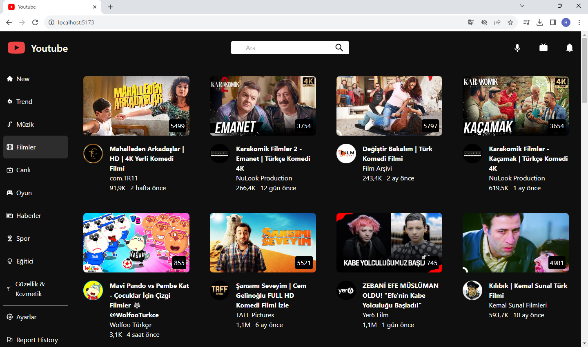
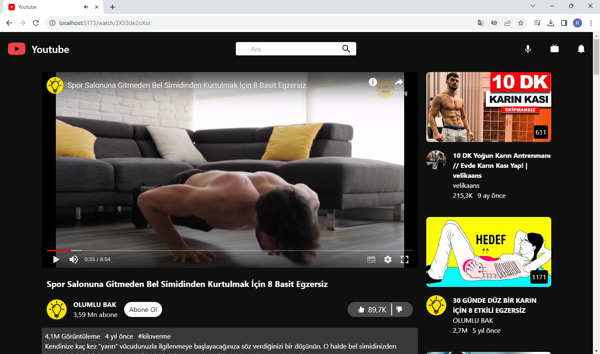
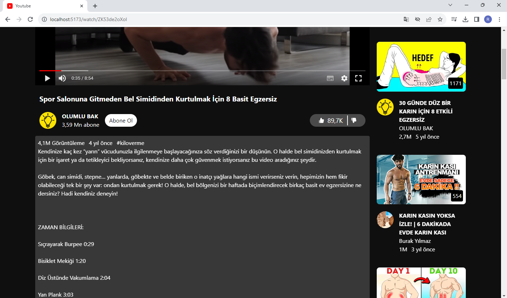
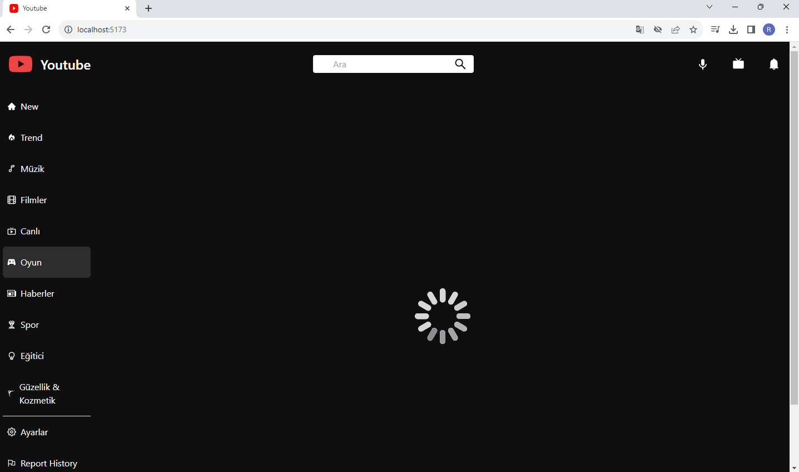
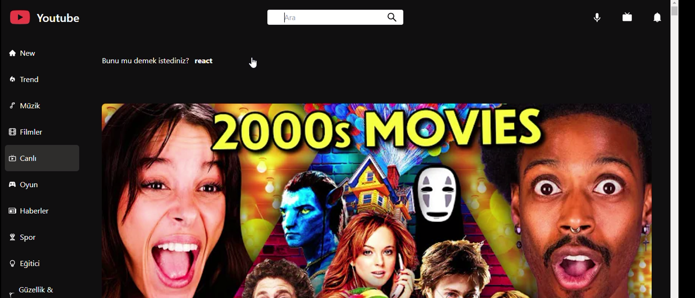

# Youtube Clone
React ile API'dan veri çekilerek Youtube projesi oluşturuldu.
Context yapısı kullanıldı.

# Kullanılan Kütüphaneler/Kaynaklar
- react-icons
- react-router-dom
- axios
- tailwind
- millify
- react-player
- moment
- rapid api

# YAPILACAKLAR

- SideNav içerisinde kategoriler listelendi.

- Seçilen kategori bilgisi context yapısında tutuldu.

- Seçilen kategoriyi tuttuğumuz state her değiştiğinde ilgili kategoriye ait video verisini al

- Feed.jsx içerisinde her video için videoyu ekrana video bas.

- Header'da arama yapıp butona basıldığında -> SearchResults.jsx

-- aratılan kelimeyi url'e parametre olarak ekle
  
--- YÖNTEMLER;

- /results/react.js

- /results?search_query=react+project

# Ekran Görüntüleri

